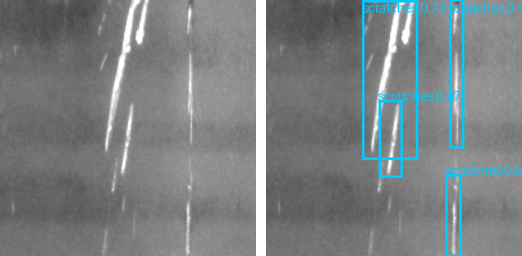
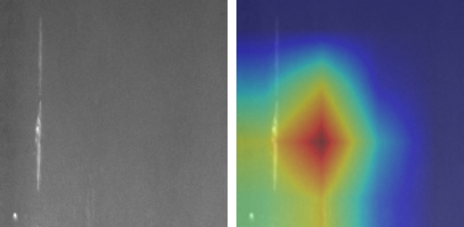
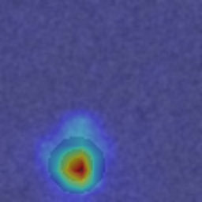
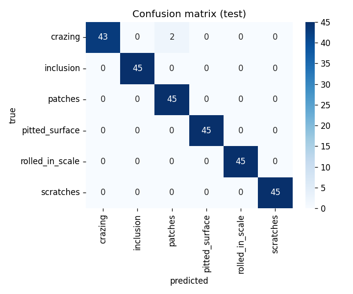
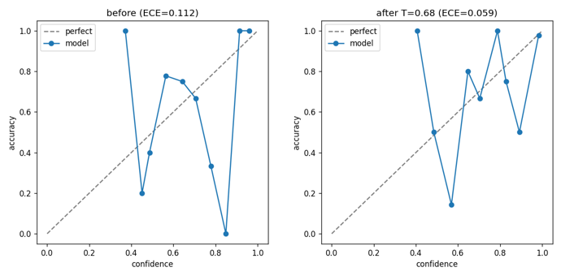

# defect-detection-qc

[](https://github.com/mohamed-abo-taha/defect-detection-qc/actions/workflows/ci.yml)

Defect detection for manufactured surfaces, trained and evaluated on the NEU steel datasets.
There are three models here: a classifier that names the defect, a YOLOv8 detector that draws a
box around it, and a PaDiM model that flags parts which don't look like a normal sample.

Most of the work went into the parts that decide whether something like this is worth deploying:
class imbalance, evaluation that separates missed defects from false alarms, explainability,
calibration, and a fast exported model.

## Approaches

| Model | Output | Use it when | Entry point |
|---|---|---|---|
| Classification | defect type per image | you have per-image labels | `src/qc/train.py` |
| Detection (YOLOv8) | bounding boxes | you have box annotations | `scripts/yolo_train.py` |
| Anomaly (PaDiM) | normal vs anomalous + heatmap | defects are rare or unlabelled | `src/qc/anomaly.py` |

## Examples

Detection, input and predicted boxes:



Grad-CAM on the classifier, input and the regions it focused on:



PaDiM anomaly map, trained on good parts only:



Confusion matrix, and a calibration reliability diagram before and after temperature scaling:





## Results

### Classification on NEU-CLS

Six defect classes, 1,800 images, ResNet-18 fine-tuned from ImageNet. NEU-CLS is balanced, so to
test the imbalance handling I capped two classes to 30 training images for a 7:1 ratio and left
validation and test balanced.

| metric, test set | cross-entropy | focal + class weights |
|---|---|---|
| macro-F1 | 0.9926 | 0.9963 |
| crazing recall, the rare class | 0.96 | 1.00 |

At 7:1 the pretrained model already sits near 99% with plain cross-entropy, and focal loss with
per-class weights mostly recovers the two missed crazing samples. The gap is wider on a harder
problem: a synthetic from-scratch run moved macro-F1 from 0.82 to 0.88, crack recall from 0.67 to
0.83, and the defect miss rate from 16.4% to 13.1%.

`evaluate.py` reports per-class precision/recall/F1, a confusion matrix, and the miss rate and
false-alarm rate separately, since in QC a missed defect and a false alarm cost different things.

### Detection on NEU-DET

YOLOv8n, 50 epochs at 256px, about 5 minutes on a 4070.

| 360 val images, 805 boxes | mAP@50 | mAP@50-95 |
|---|---|---|
| all 6 classes | 0.767 | 0.452 |
| patches / scratches / pitted_surface | 0.93 / 0.91 / 0.89 | 0.64 / 0.58 / 0.55 |
| crazing | 0.36 | 0.13 |

Crazing is the weak class. It's faint and low-contrast, and most NEU-DET baselines struggle with
it too. `scripts/yolo_infer.py` draws boxes and exports to ONNX.

### Anomaly detection with PaDiM

Fits a per-position Gaussian over ResNet-18 features of good parts and scores test images by
Mahalanobis distance, so it needs no defect labels. AUROC is 1.0 on the synthetic good/defect split
with a heatmap that lands on the defect. The synthetic defects are easy to separate; real MVTec
categories sit around 0.9 to 0.98.

### Calibration

`src/qc/calibrate.py` reports ECE, draws a reliability diagram, and fits temperature scaling.
Scaling roughly halves ECE: 0.11 to 0.06 for the cross-entropy model, 0.24 to 0.06 for the focal
one. Both fitted temperatures come out below 1, so these models are under-confident, the opposite
of the usual case for cross-entropy nets. Worth knowing if you use the confidence to decide what
gets a second look.

### Inference

ONNX with onnxruntime runs at 1.84 ms/image on CPU for the 96px model and 2.32 ms for the 128px NEU
model, matching PyTorch outputs to 1e-6. TensorRT is faster on NVIDIA hardware but needs the extra
package; for YOLO use `yolo export format=engine`.

## Focal loss

The focal-loss snippet people usually copy uses a scalar `alpha`. A scalar rescales every class by
the same amount and does nothing for imbalance; the per-class weight vector is the part that
matters. `src/qc/losses.py` supports both, and `tests/test_losses.py` has a test that pins this
down. This is the classification loss. YOLO uses its own loss, so it doesn't apply to the detector.

## Data

The datasets are committed under `data/`, so you can train and evaluate without downloading anything.

- `data/sample`: synthetic defects used by the quickstart and tests. Regenerate with `scripts/make_sample.py`.
- `data/neu`: NEU-CLS, six steel-surface defect classes, split into train/val/test.
- `data/neu_det`: NEU-DET in YOLO format, images and labels for the detector.

The NEU datasets come from Northeastern University and are widely used for surface-defect research. The
raw downloads and the induced-imbalance split are rebuilt by `scripts/prepare_neu.py` and
`scripts/prepare_neu_det.py` if you need them.

## Running it

```bash
pip install -e .                          # installs the qc package
# for GPU training, install a CUDA-matched torch first, see requirements.txt

python scripts/make_sample.py             # synthetic dataset, no downloads
python src/qc/data.py --data data/sample  # class balance audit

python src/qc/train.py --data data/sample --loss ce    --no-pretrained --out outputs/clf_ce
python src/qc/train.py --data data/sample --loss focal --no-pretrained --out outputs/clf_focal
python src/qc/evaluate.py --ckpt outputs/clf_focal/best.pt
python src/qc/explain.py  --ckpt outputs/clf_focal/best.pt --image data/sample/test/crack/crack_0000.png
python src/qc/export.py   --ckpt outputs/clf_focal/best.pt
python src/qc/anomaly.py  --data data/sample
python src/qc/calibrate.py --ckpt outputs/clf_focal/best.pt

streamlit run app.py                      # classify, detect, and ROI in one demo
pytest -q
```

Detection track:

```bash
python scripts/prepare_neu_det.py
python scripts/yolo_train.py --data data/neu_det/data.yaml --epochs 50 --imgsz 256
python scripts/yolo_infer.py --weights runs/detect/outputs/yolo/neu/weights/best.pt \
    --source data/neu_det/images/val --limit 6 --device cpu --onnx
```

To use your own data, lay it out as `data/<name>/<split>/<class>/*.png`, pass `--data data/<name>`,
and drop `--no-pretrained` for transfer learning. For boxes, point
`configs/defect_detection.example.yaml` at a YOLO-format dataset. Good public options: MVTec AD for
anomaly detection, NEU-DET or GC10-DET for detection, Severstal for an imbalanced segmentation set.

## Cost model

`src/qc/roi.py` estimates labor saved against the cost of missed defects and false alarms. It
subtracts escape cost, so it comes out negative when recall is low or escapes are expensive. With
the default assumptions it lands around $247k/year; raise the cost per escaped defect and it flips.
The numbers are yours to set.

## Tests

`pip install -e ".[dev]"` then `pytest -q`. 17 tests cover the loss, class weighting, the VOC to
YOLO conversion, and the miss/false-alarm metric. GitHub Actions runs them on CPU on every push.

## Limitations

- Trained on NEU steel surfaces. It won't transfer to other products, lighting, or cameras without
  retraining.
- NEU is an easy benchmark. These numbers are not what a noisy production line looks like.
- An out-of-distribution image still gets a confident label. The confidence slider in the demo is
  there to catch that.
- Grad-CAM shows where the model looked, not why a part is defective.

## Layout

```
src/qc/   losses, data, model, train, evaluate, explain, export, utils
          anomaly (PaDiM), calibrate (ECE + temperature), convert (VOC to YOLO), roi
scripts/  make_sample, prepare_neu, prepare_neu_det, yolo_train, yolo_infer
models/   clf_neu.pt, yolo_neu.pt        samples/  six demo images
tests/    losses, utils, metrics, convert        app.py  Streamlit demo
pyproject.toml, Dockerfile, MODEL_CARD.md, .github/workflows/ci.yml
```

## Stack

Python 3.12, PyTorch 2.6, timm, torchvision, Ultralytics YOLOv8, scikit-learn, ONNX / onnxruntime,
Streamlit. Tested on an RTX 4070 SUPER.
